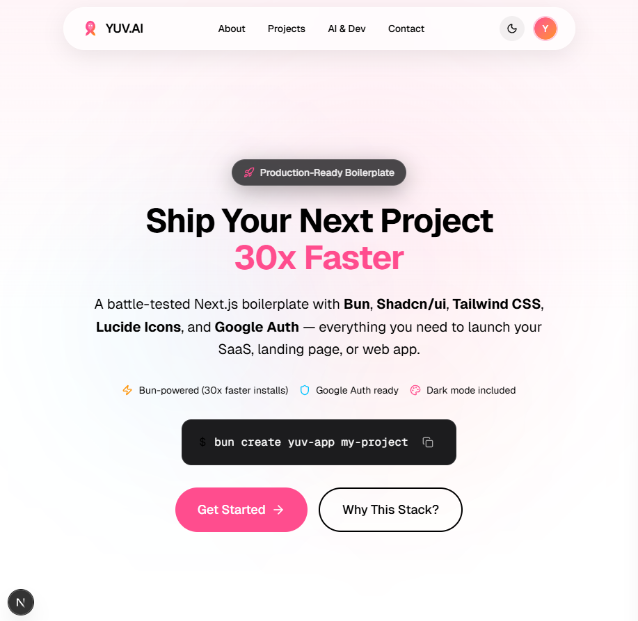

# YUV.AI Portfolio & Next.js Boilerplate

<div align="center">


[](https://www.npmjs.com/package/create-yuv-bun-app)
[](https://www.npmjs.com/package/create-yuv-bun-app)

### Ship Your Next Project 30x Faster

A production-ready, feature-packed Next.js boilerplate with stunning glassmorphism design, built-in blog system with Text-to-Speech, and everything you need to launch your next web app.

**Install in seconds:** `bun create yuv-bun-app my-project`

[Live Demo](https://nextjs-bun-starter.vercel.app) | [npm Package](https://www.npmjs.com/package/create-yuv-bun-app) | [Report Bug](https://github.com/hoodini/nextjs-bun-starter/issues)


</div>

---

## Homepage Preview

<div align="center">
  
</div>

---

## What Makes This Special?

This isn't just another boilerplate. It's a **fully-featured portfolio and web app starter** with carefully crafted features that typically take weeks to implement:

- **Stunning Glassmorphism Design** - Modern, Apple-inspired UI with animated gradient orbs
- **Built-in Blog System** - With Text-to-Speech, reading progress, and Spotify-style audio player
- **Comprehensive Mobile Support** - Every pixel is responsive
- **Dark/Light Mode** - System-aware theming that just works
- **Authentication Ready** - Google OAuth with protected routes out of the box

---

## Features Overview

### Core Stack
| Feature | Description |
|---------|-------------|
| **Next.js 16** | Latest App Router, React Server Components, streaming & Suspense |
| **React 19** | Newest React with improved performance and features |
| **Bun Runtime** | 30x faster package installation, native TypeScript |
| **TypeScript 5** | Full type safety with strict mode |

### UI & Design System
| Feature | Description |
|---------|-------------|
| **Glassmorphism Design** | Frosted glass effects, backdrop blur, and modern aesthetics |
| **Shadcn/ui Components** | Beautiful, accessible components you own and customize |
| **Tailwind CSS 4** | Latest utility-first CSS with OKLch colors |
| **Framer Motion** | Smooth animations and micro-interactions |
| **Animated Gradient Orbs** | Dynamic background effects with radial gradients |
| **Lucide Icons** | 1000+ beautiful, tree-shakeable icons |
| **Geist Font** | Clean, modern typography by Vercel |
| **Dark/Light Mode** | System-aware theme switching with next-themes |

### Blog System (Apple-Style)
| Feature | Description |
|---------|-------------|
| **Glassmorphism Cards** | Beautiful article previews with hover effects |
| **Reading Progress Bar** | Fixed progress indicator as you scroll |
| **Text-to-Speech (TTS)** | Listen to articles with browser speech synthesis |
| **Spotify-Style Audio Player** | Play/pause, speed control, voice selection |
| **Voice Selection** | Choose from available system voices |
| **Playback Speed Control** | 0.5x to 2x speed adjustment |
| **Category Tags** | Color-coded article categories |
| **Reading Time Estimates** | Automatic calculation based on content |
| **Mobile-Optimized Typography** | Responsive prose styling |

### Navigation & UX
| Feature | Description |
|---------|-------------|
| **Floating Glass Navbar** | Centered, pill-shaped navigation with blur effect |
| **Mobile Hamburger Menu** | Full-featured dropdown for mobile devices |
| **Scroll-to-Top Button** | Animated button appears on scroll |
| **Smooth Scroll Navigation** | Anchor links with smooth scrolling |
| **Copy-to-Clipboard** | One-click command copying with feedback |

### Authentication
| Feature | Description |
|---------|-------------|
| **NextAuth.js** | Industry-standard authentication |
| **Google OAuth** | Pre-configured and ready to use |
| **Protected Routes** | Secure profile page implementation |
| **Session Management** | Server and client session handling |
| **User Avatar Dropdown** | Profile menu with sign-out option |

### Developer Experience
| Feature | Description |
|---------|-------------|
| **React Hook Form** | Performant form handling |
| **Zod Validation** | Type-safe schema validation |
| **ESLint 9** | Latest linting configuration |
| **Turbopack** | Lightning-fast hot reload |
| **TypeScript Strict Mode** | Maximum type safety |

---

## Bun vs npm: The Performance Difference

| Metric | npm | Bun | Improvement |
|--------|-----|-----|-------------|
| Package Installation | ~45 seconds | ~1.5 seconds | **30x faster** |
| Disk Space | ~500MB | ~200MB | **60% smaller** |
| Script Execution | ~150ms startup | ~25ms startup | **6x faster** |

### Command Comparison

```bash
# Same commands, just replace 'npm' with 'bun'
npm install       → bun install
npm run dev       → bun run dev
npm run build     → bun run build
npx tsx file.ts   → bun file.ts    # TypeScript runs directly!
```

---

## Quick Start

### One-Line Installation (Recommended)

```bash
bun create yuv-bun-app my-project
```

Works with any package manager:
```bash
bun create yuv-bun-app my-project   # Recommended
npm create yuv-bun-app my-project   # Also works
pnpm create yuv-bun-app my-project  # Also works
yarn create yuv-bun-app my-project  # Also works
```

> **About the Package Names**
> - **`create-yuv-bun-app`** - This boilerplate (Next.js + Bun + NextAuth/Google OAuth)
> - **`create-yuv-app`** - Alternative version (Next.js + Clerk authentication)

### Manual Installation

```bash
# 1. Clone the repository
git clone https://github.com/hoodini/nextjs-bun-starter.git my-project
cd my-project

# 2. Install dependencies (~1.5 seconds with Bun!)
bun install

# 3. Set up environment variables
cp .env.example .env.local

# 4. Configure Google OAuth (see below)

# 5. Start development
bun run dev
```

### Configure Google OAuth

1. Go to [Google Cloud Console](https://console.cloud.google.com/)
2. Create a new project or select existing
3. Navigate to **APIs & Services > Credentials**
4. Click **Create Credentials > OAuth client ID**
5. Select **Web application**
6. Add authorized redirect URI: `http://localhost:3000/api/auth/callback/google`
7. Copy credentials to `.env.local`:

```env
GOOGLE_CLIENT_ID=your-client-id
GOOGLE_CLIENT_SECRET=your-client-secret
NEXTAUTH_SECRET=generate-with-openssl-rand-base64-32
NEXTAUTH_URL=http://localhost:3000
```

---

## Project Structure

```
my-project/
├── app/
│   ├── api/auth/[...nextauth]/   # Auth API routes
│   ├── blog/                      # Blog system
│   │   ├── [slug]/page.tsx       # Individual article pages
│   │   ├── layout.tsx            # Blog layout
│   │   └── page.tsx              # Blog listing page
│   ├── profile/                   # Protected profile page
│   ├── globals.css                # Global styles & theme
│   ├── layout.tsx                 # Root layout
│   ├── page.tsx                   # Homepage
│   └── providers.tsx              # Theme & Session providers
├── components/
│   ├── blog/
│   │   └── article-content.tsx   # Article with TTS player
│   ├── layout/
│   │   ├── navbar.tsx            # Floating glass navbar
│   │   └── footer.tsx            # Site footer
│   ├── sections/                  # Page sections
│   │   ├── boilerplate-hero.tsx  # Hero with gradient orbs
│   │   ├── why-this-stack.tsx    # Features showcase
│   │   ├── bun-comparison.tsx    # Bun vs npm comparison
│   │   ├── quick-start.tsx       # Getting started guide
│   │   ├── customize-section.tsx # Customization guide
│   │   ├── stack-section.tsx     # Tech stack display
│   │   └── cta-section.tsx       # Call to action
│   └── ui/                        # Shadcn components
│       ├── glass-card.tsx        # Glassmorphism card
│       ├── scroll-to-top.tsx     # Scroll button
│       ├── mode-toggle.tsx       # Theme toggle
│       └── ...                   # Other UI components
├── lib/
│   ├── blog.ts                   # Blog posts data
│   └── utils.ts                  # Utility functions
├── public/
│   ├── round-avatar.svg          # Logo/favicon
│   └── homepage-demo.png         # README preview image
├── .env.example                   # Environment template
└── package.json                   # Dependencies
```

---

## Customization Guide

### 1. Branding & Colors
Edit `app/globals.css` to update the color scheme:
```css
@theme {
  --color-primary: oklch(0.7 0.2 340);  /* Your brand color */
}
```

### 2. Add Blog Posts
Edit `lib/blog.ts` to add your own articles with TTS support:
```typescript
const posts: BlogPost[] = [
  {
    slug: 'my-article',
    title: 'My Article Title',
    content: 'Plain text for TTS...',
    contentHtml: '<p>HTML for rendering...</p>',
    // ...
  }
];
```

### 3. Authentication Providers
Add more providers in `app/api/auth/[...nextauth]/route.ts`:
```typescript
import GithubProvider from "next-auth/providers/github"

providers: [
  GoogleProvider({ ... }),
  GithubProvider({
    clientId: process.env.GITHUB_ID!,
    clientSecret: process.env.GITHUB_SECRET!,
  }),
]
```

### 4. Add More UI Components
```bash
bunx shadcn@latest add dialog
bunx shadcn@latest add toast
bunx shadcn@latest add table
```

---

## Available Scripts

```bash
bun run dev      # Start development server (Turbopack)
bun run build    # Create production build
bun run start    # Start production server
bun run lint     # Run ESLint
```

---

## Deployment

### Vercel (Recommended)

[](https://vercel.com/new/clone?repository-url=https://github.com/hoodini/nextjs-bun-starter)

1. Push to GitHub
2. Import in Vercel
3. Add environment variables:
   - `GOOGLE_CLIENT_ID`
   - `GOOGLE_CLIENT_SECRET`
   - `NEXTAUTH_SECRET`
   - `NEXTAUTH_URL` (your production URL)
4. Update Google OAuth redirect URI for production

### Other Platforms

Works on any platform that supports Node.js:
- Netlify
- Railway
- Render
- Docker

---

## Feature Checklist

### Core
- [x] Next.js 16 with App Router
- [x] React 19
- [x] TypeScript 5 (strict mode)
- [x] Bun runtime

### UI & Design
- [x] Glassmorphism design system
- [x] Shadcn/ui components
- [x] Tailwind CSS 4
- [x] Framer Motion animations
- [x] Animated gradient orbs
- [x] Floating glass navbar
- [x] Lucide Icons
- [x] Dark/Light mode
- [x] Responsive design
- [x] Geist font

### Blog System
- [x] Apple-style blog layout
- [x] Glassmorphism article cards
- [x] Reading progress bar
- [x] Text-to-Speech (TTS)
- [x] Spotify-style audio player
- [x] Voice selection
- [x] Playback speed control
- [x] Category tags
- [x] Reading time estimates

### Authentication
- [x] NextAuth.js
- [x] Google OAuth
- [x] Protected routes
- [x] Session management
- [x] User profile page

### UX Features
- [x] Scroll-to-top button
- [x] Copy-to-clipboard
- [x] Smooth scroll navigation
- [x] Mobile hamburger menu

### DX
- [x] React Hook Form + Zod
- [x] ESLint 9 configured
- [x] Fast refresh with Turbopack

---

## Recent Updates

| Version | Feature |
|---------|---------|
| Latest | Comprehensive mobile responsiveness overhaul |
| | Custom favicon and navbar logo |
| | Spotify-style TTS audio player |
| | Apple-style blog system with progress bar |
| | Enhanced gradient glow orbs |
| | Glassmorphism styling across all cards |
| | Floating glass navbar |
| | Scroll-to-top button |
| | Theme toggle with dark/light mode |

---

## Contributing

Contributions welcome! Please read the [Contributing Guide](CONTRIBUTING.md).

1. Fork the repository
2. Create feature branch: `git checkout -b feature/amazing-feature`
3. Commit changes: `git commit -m 'Add amazing feature'`
4. Push: `git push origin feature/amazing-feature`
5. Open a Pull Request

---

## License

MIT License - see [LICENSE](LICENSE) for details.

---

## About the Creator

<div align="center">


**Yuval Avidani**

AWS AI Superstar | GitHub Star | Founder of YUV.AI

Building next-generation AI solutions and empowering developers to create transformative experiences.

[](https://yuv.ai)
[](https://github.com/hoodini)
[](https://www.linkedin.com/in/%F0%9F%8E%97%EF%B8%8Fyuval-avidani-87081474/)
[](https://twitter.com/yuvai)
[](mailto:info@yuv.ai)

</div>

---

<div align="center">

**Built with passion by [Yuval Avidani](https://yuv.ai)**

If this helped you ship faster, consider [starring the repo](https://github.com/hoodini/nextjs-bun-starter)

</div>
